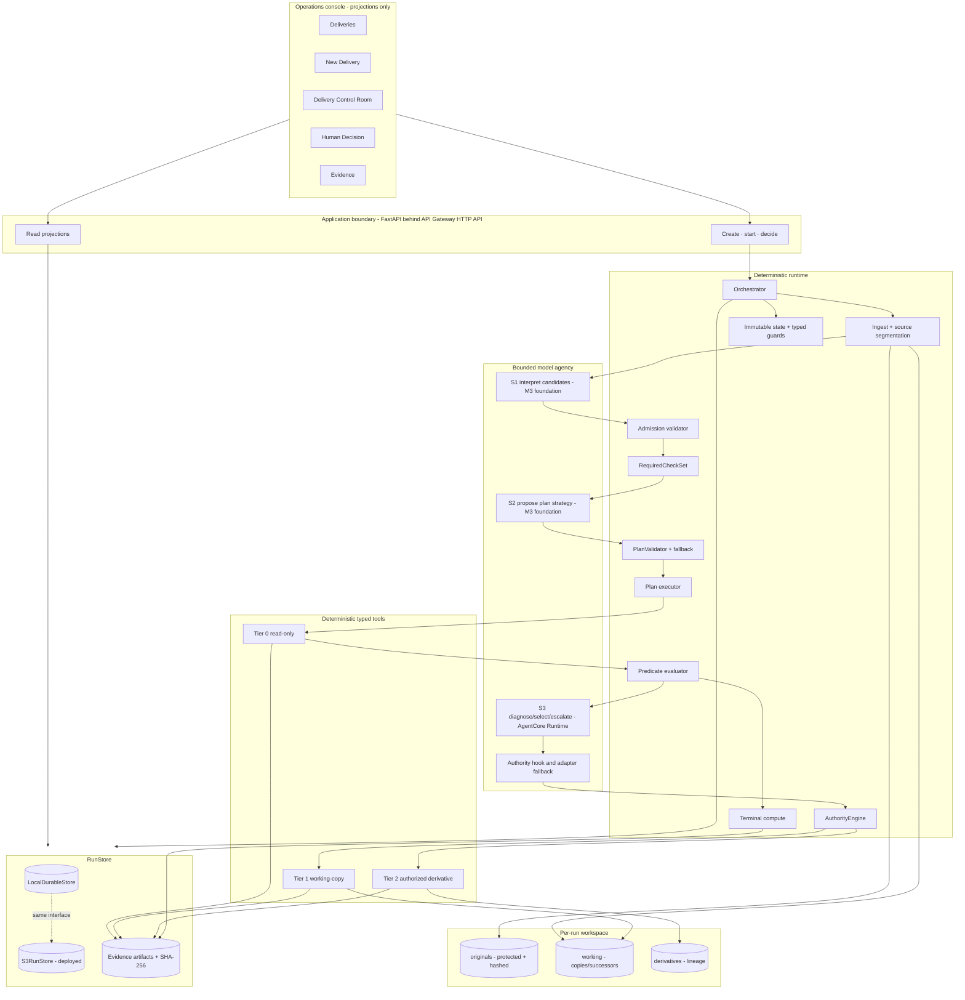
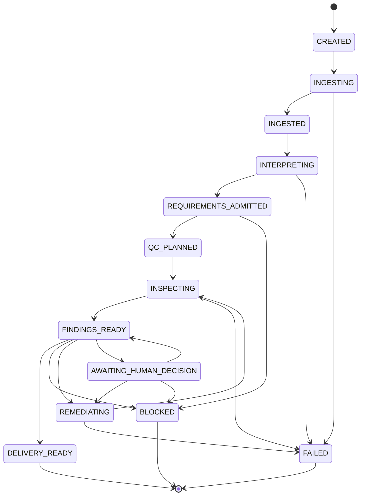

# AIRCheck architecture

**Status:** Canonical v1 architecture. R2 established the foundation, M1
deterministic media truth, M2 the frozen synthetic universe, and M3 bounded
S1/S2 semantics. M4 through M6 added execution, product truth wiring, and
evaluation. M7 deployed the runtime and M8 hardened the release.

## Governing doctrine

AIRCheck is a compiler plus a supervised executor. The model may interpret and propose; deterministic code admits, proves coverage, measures, evaluates, authorizes, mutates, records, and terminates.

```text
Prose → predicates → facts → authority → evidence
```

No green UI state, model statement, tool name, or action-completed claim can produce readiness. `terminal.compute()` is the only constructor of a trusted `TerminalVerdict`.

## System architecture



The repository includes the frozen data contracts, deterministic media
inspection and predicate evaluation, the Northstar synthetic proof universe,
the execution loop, product projections, and the evaluation corpus. The
deployed M7/M8 path adds API Gateway HTTP APIs, Lambda containers, S3 durable
state and evidence, and a real AgentCore Runtime component for the bounded
diagnose/select/escalate seam. The deterministic runtime validates that
recommendation and retains authority over every side effect and terminal
verdict.

M3 remains a historical scope boundary: its S1/S2 work did not execute plans,
expose agent tools, remediate assets, or run terminal workflow.

## Trust boundaries

| Boundary | Allowed crossing | Deterministic enforcement |
| --- | --- | --- |
| Specification prose → model | Delimited untrusted source text | Typed `CandidateRequirement`; no instruction slot |
| Candidate → trusted requirement | Segment IDs, quote, drafts, diagnostic confidence | `admission.admit()` verifies catalog, canonical units, source severity, provenance, and applicability polarity |
| Required checks → semantic plan | Ordering/grouping and bounded extra Tier-0 checks | `PlanValidator` proves mandatory coverage and safety; one retry then deterministic fallback |
| Runtime → tools | Typed IDs and canonical values | Runtime-only path resolver; no filesystem path in agent-facing I/O |
| Agent → any tool | Tool call intercepted before execution | State-aware `AuthorityEngine`; option binding; Tier-2 opaque Authorization |
| Action intent → filesystem | Validated action context | State transition and `ACTION_STARTED` precede I/O; ORIGINAL writes always fail |
| Runtime → terminal state | Same-run/cycle `TerminalVerdict` | Only `terminal.compute()` constructs verdict; typed state guard consumes it |
| Backend → UI | Read projection | UI displays backend enum/verdict; no frontend terminal calculation |

## Canonical data model

All domain objects are Pydantic v2 frozen models or frozen dataclasses. Collections are tuples or immutable mappings; no domain field may expose `list`, `dict`, or `set`. Descriptive objects are write-once. Mutable lifecycle values live in replacement snapshots persisted by stores, not in-place nested mutation.

### Source and requirement provenance

- `SourceDocument`: raw/normalized SHA-256, normalized text, kind, title, ingest timestamp.
- `SourceSegment`: deterministic index, offsets, text, segment hash, nearest source reference.
- `SourceSpan`: one to three contiguous segments in one document; runtime-owned offsets/text and a verified model quote.
- `CandidateRequirement`: untrusted semantic proposal with segment citations and drafts.
- `Requirement`: trusted admission result with source-owned severity, normalization result/reasons, scope, applicability, constraint, verification binding, disposition, rendered text, and candidate provenance.
- `ExecutableRequirement`: type-level marker that a trusted requirement has an executable constraint.

Normalized text uses UTF-8 semantics, LF line endings, and stripped trailing horizontal whitespace. Deterministic segmentation attaches the nearest heading/clause and prefers numbered clauses, then paragraphs, then sentences.

### Execution truth

- `RunContext`, `DestinationProfile`, `Asset` and immutable lineage.
- `RequiredCheck`, untrusted `PlanProposal`, validated `QCPlan`/`QCPlanItem`.
- `Measurement` with `OK|ERROR`; `PredicateResult` with `PASS|FAIL|NOT_EVALUATED`.
- `Finding` with `OPEN|RESOLVED|UNRESOLVED` and fully specified `RemediationOption` values.
- `DecisionRequest`, immutable human `Decision`, and opaque `Authorization` capability.
- `Action`, append-only typed `Event`, and hashed `EvidenceArtifact`.
- `TerminalCounts`, trusted `TerminalVerdict`, and `DeliveryRun` snapshot.

Important invariants:

1. Only admission constructs trusted requirements.
2. Source spans/quotes must match deterministic segments.
3. Every executable applicable requirement has exactly one required check and appears in every cycle plan.
4. PASS requires an OK measurement; ERROR becomes NOT_EVALUATED.
5. ORIGINAL hashes match ingest at terminal and no action writes an ORIGINAL.
6. Tier-1 actions exactly match an open finding's option/canonical args.
7. Tier-2 execution consumes one matching ISSUED authorization atomically before I/O.
8. DELIVERY_READY requires no unresolved blocking semantics/findings/measurements/decisions and verified original integrity.
9. Domain collections are deeply frozen.
10. Events have increasing sequence and snapshot state agrees with the last transition.
11. Source modal language owns severity; model proposals cannot reduce it.
12. Applicability field/value/operator/polarity must be proven from source.
13. `ACTION_COMPLETED` always follows matching `ACTION_STARTED` and a verified promoted asset.

## Constraint and admission architecture

### Normalization outcomes

`EXECUTABLE`, `AMBIGUOUS`, `CONTRADICTORY`, `UNSUPPORTED`, and `EXTERNAL_DEPENDENCY` are orthogonal to applicability, predicate result, severity, and remediation disposition. Blocking non-executable outcomes remain visible and block terminal readiness.

### Constraint language

Exactly eight operators are supported:

```text
EQUALS · MIN · MAX · RANGE · ONE_OF · MATCHES_PATTERN · PRESENT · ABSENT
```

Every executable constraint names a closed-catalog measurement key and canonical unit. The runtime renders constraints deterministically and rejects incomplete or incompatible operator/value shapes.

### Source-owned severity

Deterministic modal parsing owns normative severity:

- explicit MUST/SHALL/REQUIRED/prohibition → `BLOCKING`;
- SHOULD/RECOMMENDED → `WARNING`;
- MAY/OPTIONAL → `INFO`;
- unknown or mixed modal language → fail-closed `BLOCKING` with a named reason.

The candidate's proposed obligation and confidence are diagnostic/evaluation metadata only.

### Applicability

Trusted conditions form a conjunction using only:

- fields: `asset.role`, `run.content_type`, `run.destination_profile`;
- operators: `EQ`, `NEQ`, `IN`;
- values and polarity anchored in a cited source segment.

Unsupported or uncertain conditional language yields `UNRESOLVED`, never an invented condition or silent global rewrite.

### Closed measurement catalog

The catalog binds measurement keys to value kind, canonical unit, allowed operators, verification tool, default severity/disposition, and applicable scope. Unknown keys cannot become executable requirements. R2 defines the catalog/validators; M1 implements measurements.

## Deterministic lifecycle



`CANCELLED` is absent unless a real cancel control is authorized later. `DELIVERY_READY`, `BLOCKED`, and `FAILED` are terminal. Re-verification is `INSPECTING` with `cycle >= 1`; maximum cycles are three.

The transition mapping and guard mapping are private read-only proxies with frozenset values. The public state module exposes transition queries/functions, not writable tables. Guarded edges require typed same-run payloads:

- `FINDINGS_READY → DELIVERY_READY|BLOCKED`: trusted `TerminalVerdict`;
- `FINDINGS_READY → REMEDIATING`: bound Tier-1 `RemediationSelection`;
- `FINDINGS_READY → AWAITING_HUMAN_DECISION`: pending `DecisionRequest`;
- `AWAITING_HUMAN_DECISION → REMEDIATING`: matching ISSUED `Authorization`;
- denied decisions route to findings or blocked according to remaining admissible options.

No actor `AGENT` may cause a transition.

## Terminal computation

`terminal.compute(run)` evaluates blocking requirements only after measurement/predicate facts exist. It fails closed on unresolved normalization, unresolved applicability, FAIL, NOT_EVALUATED, pending decisions, remediation loop exhaustion, and changed originals. It returns:

- `None` while a pending decision or admissible remediation keeps the run active;
- `TerminalVerdict(DELIVERY_READY)` only when every blocking applicable predicate passes and originals match;
- `TerminalVerdict(BLOCKED)` when terminal blockers remain without an admissible next action.

WARNING/INFO requirements appear in evidence but do not control readiness.

## Authority architecture

| Tier | Target | Rule |
| --- | --- | --- |
| 0 | Any run asset, read-only | Allowed in `INSPECTING` or `FINDINGS_READY` |
| 1 | WORKING/DERIVATIVE successor | Requires an OPEN finding and exact option/canonical-argument binding; runtime enters REMEDIATING before I/O |
| 2 | DERIVATIVE successor | Tier-1 conditions plus matching persisted ISSUED Authorization, atomically consumed at `ACTION_STARTED` |
| Forbidden | ORIGINAL write or unknown/unregistered operation | Always refused; approval cannot elevate it |

The capability identifier is randomly/runtime minted and opaque. A canonical-argument hash is deterministic binding identity, not authorization. Public values cannot predict or mint the capability.

Seven enforcement layers are required:

1. frozen `ToolSpec` tier metadata;
2. state-aware `AuthorityEngine` plus `AuthorityStore`;
3. Strands `BeforeToolCallEvent` hook on every enabled agent tool call;
4. `ActionExecutor.begin()` verifies binding/authorization and persists `ACTION_STARTED` before I/O;
5. typed state guards require selection/authorization before REMEDIATING;
6. UI decision command accepts only the current pending decision and never receives the authorization identifier;
7. persisted decision, authorization, action, and terminal-integrity events.

After approval, the deterministic runtime executes the already-bound option; no persisted model conversation resumes. An action failure voids the consumed authorization. Retry requires a new decision request and capability.

## Tool contracts

Agent-facing inventory is exactly nine:

| Tool | Tier | R/W | Purpose | Current behavior |
| --- | --- | --- | --- | --- |
| `scan_package` | 0 | R | Asset/role/filename/manifest presence measurements | Deterministic runtime tool |
| `probe_media` | 0 | R | Container/video/audio stream measurements | Deterministic runtime tool |
| `measure_loudness` | 0 | R | Integrated loudness, true peak, loudness range | Deterministic runtime tool |
| `inspect_captions` | 0 | R | SRT/WebVTT structure/timing measurements | Deterministic runtime tool |
| `verify_manifest` | 0 | R | Checksum comparison measurement/details | Deterministic runtime tool |
| `rename_delivery_copy` | 1 | W working | Successor with compliant runtime-computed name | Exact finding and option binding required |
| `write_checksum_manifest` | 1 | W working | Current-package checksum manifest successor | Exact finding and option binding required |
| `convert_caption_format` | 1 | W working | Lossless SRT↔WebVTT successor | Exact finding and option binding required |
| `create_normalized_audio_derivative` | 2 | W derivative | Human-authorized loudness-normalized derivative | Matching persisted human authorization required |

Common rules:

- Inputs use `run_id`, `asset_id`, `finding_id`, or `option_id`, never paths.
- Outputs are typed measurements/remediation results plus evidence references.
- Expected tool failure returns typed ERROR and never passes a predicate.
- An uncaught runtime/tool crash transitions the run to FAILED.
- Tier-1/2 tools require a validated action context; direct calls refuse before I/O.
- Tier-1 and Tier-2 execution is implemented by the runtime; direct calls still refuse without a validated action context.

Runtime-internal functions include hashing, document segmentation, required-check derivation, plan validation, predicate evaluation, filename evaluation, decision creation, terminal compute, report rendering, and ledger export.

## Asset/path and side-effect protocol

The model never sees a filesystem path. Runtime resolution uses a per-run root and verifies `realpath` containment. READ may resolve any run asset. WRITE rejects ORIGINAL and targets only deterministic working/derivative destinations.

Side effects follow:

```text
enter REMEDIATING
→ validate option/authorization
→ persist ACTION_STARTED (consume Tier-2 authorization atomically)
→ write action-specific temporary output
→ verify media/hash/round-trip properties
→ atomically promote
→ persist successor Asset
→ emit ACTION_COMPLETED
```

Failure emits `ACTION_FAILED` and removes/quarantines partial output. Recovery discards temp-only output and hash-verifies promoted-but-uncommitted output before idempotent commit or quarantine. Evidence never precedes reality.

## Persistence

`RunStore` is the domain boundary for snapshots, append-only events, decisions, and authorizations. `LocalDurableStore` remains the development and recovery reference, while the deployed `S3RunStore` is authoritative and versioned: per-run conditional-write leases serialize conflicting mutations, fresh containers rehydrate durable state, and synchronization failures fail closed. Production container disk is disposable workspace and cache only.

## UI architecture

The five routes remain projections with no verdict logic. M5 wires read projections, create/start/decide commands, and real artifact downloads. The deployed M7/M8 release serves those surfaces through the Lambda and API Gateway boundary. The visual system remains dark and editorial; terminal state is always supplied by the backend.

## Deployment path

M7 deployed the API and web containers on AWS Lambda behind API Gateway HTTP APIs in `us-east-1`. AWS CodeBuild builds the release images in the cloud. S3 is the authoritative durable system of record for run state and evidence, while Lambda disk is disposable workspace and cache.

The deployed semantic seam is a real Amazon Bedrock AgentCore Runtime component running a Strands agent with Amazon Bedrock Nova Lite. It performs the bounded diagnose/select/escalate recommendation step over typed findings and admitted options. The AIRCheck runtime validates the untrusted result and falls back visibly on AgentCore faults or malformed output. It retains ownership of measurements, predicates, authority, filesystem side effects, evidence, and terminal verdicts.

CloudWatch logs and service observability provide structured API and AgentCore runtime records with correlation information and an error alarm. Complete trace spans are not claimed.
