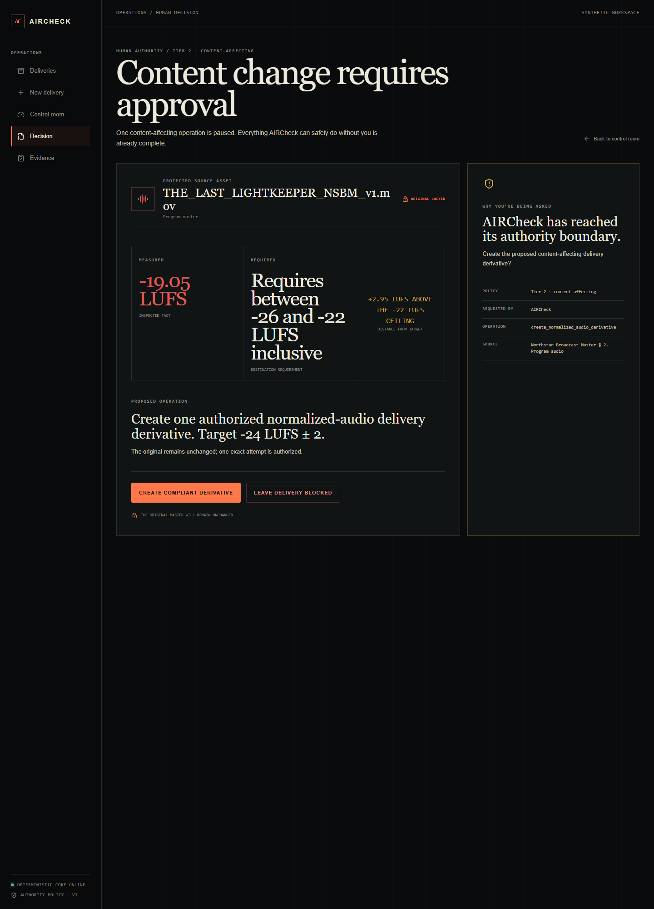
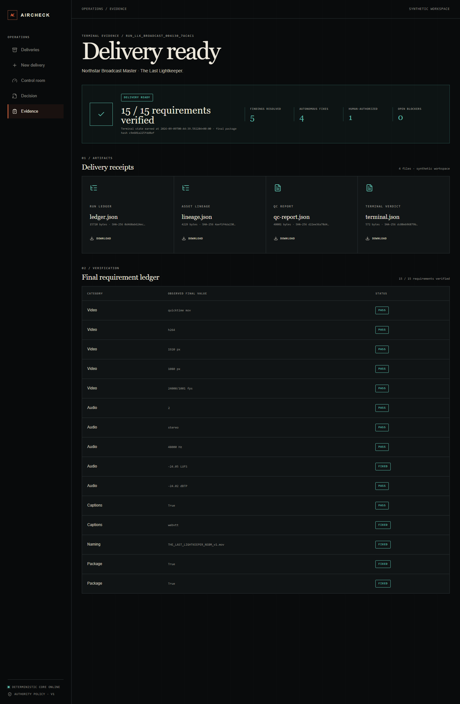
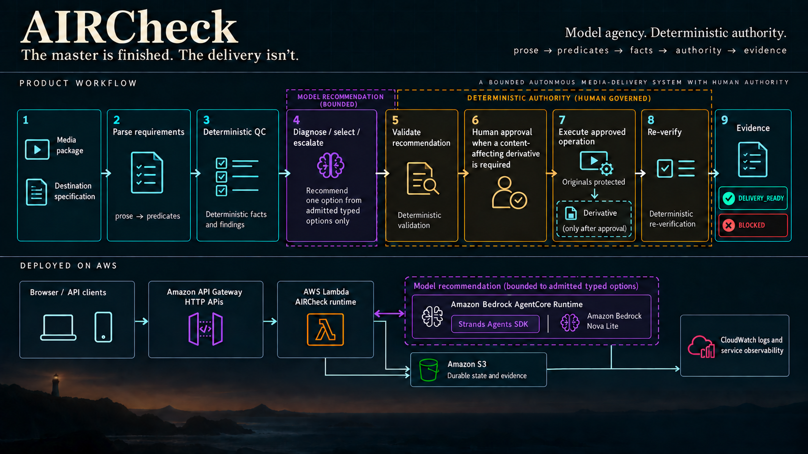

# AIRCheck

> **The master is finished. The delivery isn't.**

A finished master can still fail delivery. A destination may impose exact requirements around loudness, captions, naming, checksums, package structure, and other technical details that are easy to miss at the end of a long post-production process.

AIRCheck is an autonomous media-delivery agent for post-production professionals, finishing producers, and delivery coordinators. It reads a finished media package and a human-readable destination specification, turns the requirements into a typed QC plan, measures the package, recommends bounded remediation, asks for human authority when a content-affecting change is needed, re-verifies the result, and records the evidence.

The terminal outcome is deliberately small: `DELIVERY_READY` or `BLOCKED`.

[Open the live demo](https://x9qx3tr3i6.execute-api.us-east-1.amazonaws.com). It is a bounded synthetic workspace built around the fictional program **The Last Lightkeeper** and the **Northstar Broadcast Network** profiles.



*The public workflow pauses when a content-affecting operation needs authority. The original remains locked while the decision is pending.*

## What the deployed hero proves

The Northstar Broadcast Master hero measures **-19.05 LUFS** against a required range of **-26 to -22 LUFS**. AIRCheck identifies `create_normalized_audio_derivative` as a Tier 2 operation. The screen marks the source as `ORIGINAL LOCKED` and describes the exact proposed change.

Approval grants one bounded capability. AIRCheck creates the derivative, runs QC again, and lets deterministic terminal logic produce `DELIVERY_READY` with **15/15 requirements verified**. A denial produces `BLOCKED`. The evidence package includes a ledger, asset lineage, QC report, terminal evidence, and semantic provenance.



## Architecture

**Model agency. Deterministic authority.**



Bounded model agency participates in specification interpretation and planning, and the deployed AgentCore diagnosis seam recommends from admitted typed options. Deterministic admission turns supported proposals into trusted requirements and predicates. Deterministic systems decide what is true and what is allowed. The model does not own measurement truth, predicate truth, authorization, action-completion truth, or terminal readiness.

The detailed design is in [`ARCHITECTURE.md`](ARCHITECTURE.md). Its governing chain is:

```text
prose → predicates → facts → authority → evidence
```

## Core workflow

| Stage | Owner | What happens |
| --- | --- | --- |
| Intake | Deterministic runtime | Preserve and hash the originals. Read the destination specification and package metadata. |
| Requirement model | Model proposal + deterministic admission/planning validation | Model agency proposes specification semantics; deterministic admission creates trusted requirements, required checks are derived deterministically, and bounded planning is validated by `PlanValidator` before execution. |
| QC | Typed deterministic tools | Measure loudness, captions, streams, naming, manifests, checksums, and other closed-catalog facts. |
| Diagnosis | AgentCore, Strands, and Nova Lite | Recommend `APPLIED`, `ESCALATE`, or `NO_ACTION` only from the options already exposed by the runtime. |
| Authority | Deterministic validation and a person | Validate the recommendation. Require an explicit decision for a content-affecting derivative. |
| Execution | Runtime and typed tools | Execute the already-bound operation against a working copy or derivative. Never write an original. |
| Re-verification | Deterministic runtime | Inspect the new package, re-hash protected originals, compute the terminal state, and record evidence. |

Correct facts do not make correct evidence if the relationships between those facts are wrong. AIRCheck keeps those relationships in typed state, guarded transitions, and an append-only event ledger.

## Authority model

Human approval is a capability grant for one exact operation, not a vague fallback.

| Tier | Rule |
| --- | --- |
| Tier 0: inspection | Read-only measurement and reporting on any run asset. |
| Tier 1: reversible | A bound option may write a working-copy or derivative successor. |
| Tier 2: content-affecting | Requires an explicit human decision and one opaque, persisted, runtime-minted authorization. |
| Tier 3: forbidden | Never overwrite or delete protected originals, invent facts, silently resolve contradictions, or claim external delivery. |

After approval, the deterministic runtime executes the already-bound option. It does not resume a model conversation to decide what to do next. If execution fails, the consumed authorization is void and a new decision is required for another attempt.

## The five product surfaces

| Surface | Route | Purpose |
| --- | --- | --- |
| Deliveries | `/` | Operations ledger across active, blocked, and ready runs. |
| New Delivery | `/new` | Media-package and destination-specification intake. |
| Delivery Control Room | `/runs/<runId>` | Requirements, event timeline, and package lineage. |
| Human Decision | `/runs/<runId>/decision` | Measured facts, proposed content change, and explicit approve or block outcomes. |
| Evidence | `/runs/<runId>/evidence` | Terminal counts, requirement ledger, lineage, and artifacts that exist. |

## Deployed AWS path

The public release runs in `us-east-1` as portable containers on AWS Lambda behind API Gateway HTTP APIs. S3 is the authoritative durable system of record. The Lambda filesystem is disposable workspace and cache, so a fresh container can reconstruct a run from durable state rather than trusting process memory.

| Component | Why it exists |
| --- | --- |
| API Gateway HTTP APIs | The public HTTPS ingress for the browser and API clients. |
| AWS Lambda | Runs the API and web containers and scales to zero between requests. |
| Amazon S3 | Stores versioned run state, media/evidence workspace, and the receipts needed after a restart. A per-run conditional-write lease serializes conflicting human decisions across containers. |
| Amazon Bedrock AgentCore Runtime | Hosts the real bounded diagnose/select/escalate seam. Its untrusted recommendation is validated again by the deterministic runtime, with a visible fallback on failure or malformed output. |
| Strands Agents SDK and Amazon Bedrock Nova Lite | Provide the deployed model-agent implementation at that one bounded seam. The release uses model id `us.amazon.nova-lite-v1:0`. |
| CloudWatch | Provides logs and service observability, including correlated API and AgentCore invocation records. Complete trace spans are not claimed. |
| AWS CodeBuild | Builds the API, web, and AgentCore images in the cloud and independently exercises the public release. |

The three deployed images are pinned to the engineering source SHA recorded in [`M8.8_release_manifest.json`](docs/evidence/M8/M8.8_release_manifest.json). The API `/health` response reports the deployed revision, persistence mode, region, and AgentCore status.

## Evidence and verification

- [M8 public acceptance](docs/evidence/M8/M8.9_public_acceptance.txt) covers the live hero, denial, AgentCore provenance, concurrency, cold start, visible fallback, and evidence downloads.
- [Canonical verification](docs/evidence/M8/M8.11_final_engineering_verify.txt) records 305 backend tests, 22 frontend tests, production build, lint, and whitespace checks.
- [Fresh-clone reproduction](docs/evidence/M8/M8.7_fresh_clone.txt) records install, verification, and the provider-free local demo from a clean checkout.
- [Independent CodeBuild verification](docs/evidence/M8/M8.10_external_verification.txt) drives the public HTTPS workflow from an AWS host with no localhost or workstation dependency.
- The deterministic M6 evaluation harness froze 27 scenarios and closed GREEN after adversarial review. Its result is bounded to the fields and relationships it grades. See [`docs/evidence/M6/RESULTS.md`](docs/evidence/M6/RESULTS.md).

## Local deterministic demo

Requirements: Python 3.11 or later, Node.js 22.13 or later, npm, Git, and locally available `ffmpeg` and `ffprobe`.

With GNU Make:

```text
make install test demo
```

On Windows without GNU Make, use the cross-platform runner directly:

```powershell
python scripts/project.py install
python scripts/project.py test
python scripts/project.py demo
```

For the full local verification, including the production build and lint:

```powershell
python scripts/project.py verify
```

The local demo uses the frozen synthetic universe and does not require AWS credentials or a model-provider call. The AWS deployment is a separate operator path.

## Scope and limitations

AIRCheck is currently a bounded synthetic-universe hackathon deployment. The media, destination profiles, and program are fictional fixtures used to make the workflow reproducible.

This release is not a generic chatbot, an unrestricted file-processing service, a production multi-tenant SaaS deployment, or a replacement for human authority over consequential content changes. It does not submit packages to an external broadcaster. Real adoption would still require organization-specific security, retention, integrations, operational controls, and media policy.

The deployed observability surface is CloudWatch logs and service observability with correlated API and AgentCore invocation records. Complete trace spans are not claimed here.

## Repository map

```text
aircheck/                  Deterministic domain, runtime, media, authority, evidence, and persistence
apps/api/                  FastAPI application boundary and public projections/commands
apps/web/                  Five-surface operations console
deploy/                    Container, CodeBuild, Lambda, API Gateway, and AgentCore deployment tooling
specifications/northstar/  Frozen Northstar destination profiles and source material
evals/                     Deterministic adversarial and corpus evaluation harnesses
tests/                     Backend and frontend regression coverage
docs/evidence/              Gate receipts, public acceptance, release identity, and reproducibility records
scripts/project.py         Cross-platform install, test, build, lint, verify, and demo runner
```

Product boundaries live in [`PRODUCT_CONTRACT.md`](PRODUCT_CONTRACT.md), architecture in [`ARCHITECTURE.md`](ARCHITECTURE.md), accepted engineering choices in [`DECISIONS.md`](DECISIONS.md), and security notes in [`SECURITY.md`](SECURITY.md).

## License

Apache-2.0. See [`LICENSE`](LICENSE).
